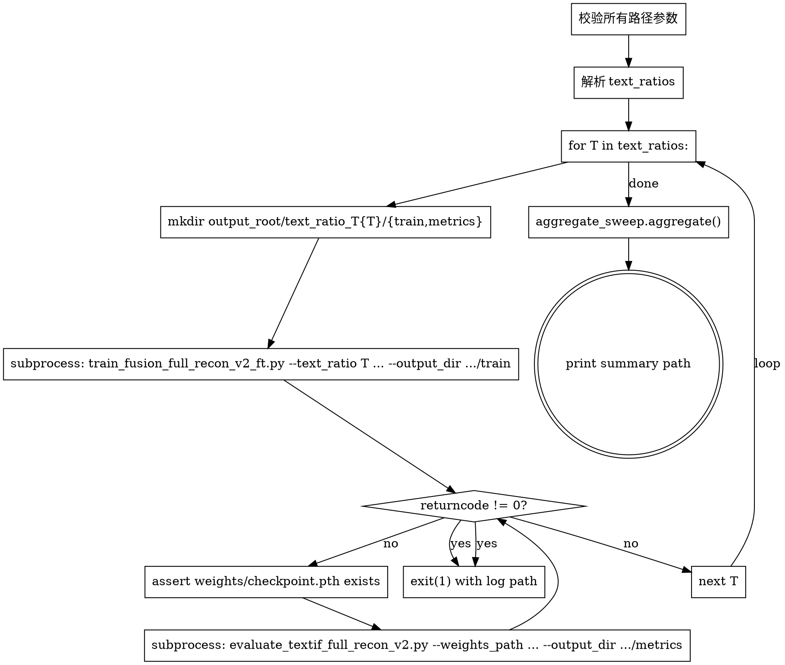

# Python Sweep Runner 设计文档

**Date**: 2026-07-25
**Status**: Design
**Parent spec**: `2026-07-24-text-ratio-sweep-design.md`（任务 A 的补充实现）
**Target script**: `train_fusion_full_recon_v2_ft.py` + `evaluate_textif_full_recon_v2.py` + `sweeps/aggregate_sweep.py`

## 1. 目标与动机

### 1.1 当前问题

任务 A 已经交付了 bash + sbatch 的扫描 harness（`run_single.sh` + `sweep_text_ratio.sbatch` + `aggregate_sweep.py`），每个 SLURM array task 调用一次 bash 脚本跑一个 `text_ratio`。

用户希望增加一个 **Python 全流程驱动**：一次 `python` 调用就串行跑完所有 `text_ratio` 值（训练 + 评估 + 聚合），由一个简化的 sbatch 单任务调用。

### 1.2 设计目标

- **G1（CLI 驱动）**：所有输入通过 CLI 参数，不依赖环境变量，自文档化（`--help` 即可看懂）
- **G2（串行全流程）**：一次调用按顺序跑完 N 个 `text_ratio` 值的训练 + 评估，最后聚合
- **G3（fail-fast）**：任意一个 `text_ratio` 训练或评估失败，立即停止后续 T 值，避免浪费 GPU 时间
- **G4（复用现有输出契约）**：输出目录结构与现有 bash harness 完全一致（`text_ratio_T{T}/{train,metrics}/`），聚合脚本、Pareto 画图等下游工具无需改动
- **G5（复用 `aggregate_sweep.aggregate`）**：不重新实现聚合逻辑，直接 `from sweeps.aggregate_sweep import aggregate`

### 1.3 非目标（YAGNI）

- ❌ 不做断点续跑（用户手动编辑 `--text_ratios` 列表跳过已完成的）
- ❌ 不做并行执行（sbatch 只申请 1 张卡）
- ❌ 不做多维 grid（只扫 `text_ratio`）
- ❌ 不做 conda 激活（sbatch 在调用 Python 前已激活环境）
- ❌ 不删除 `run_single.sh`（保留作为 SLURM array 形式的替代方案）
- ❌ 不透传所有训练超参（只透传 `--val_every_epcho` 和 `--epochs`，其他保持训练脚本默认）

## 2. 接口设计

### 2.1 CLI

```bash
python sweeps/run_sweep.py \
    --text_ratios 0,1,2,3,5,8,10,15 \
    --repo_dir <REPO> \
    --pretrained_weights <CKPT> \
    --dataset_ll <LL> \
    --dataset_oe <OE> \
    --dataset_ic <IC> \
    --dataset_in <IN> \
    --eval_data_path <EVAL> \
    [--output_root sweeps/out] \
    [--val_every_epcho 1] \
    [--epochs N]
```

### 2.2 参数说明

| 参数 | 类型 | 默认 | 说明 |
|------|------|------|------|
| `--text_ratios` | str (CSV) | **required** | 逗号分隔的 text_ratio 列表，例如 `0,1,2,3,5,8,10,15` |
| `--repo_dir` | str | **required** | 仓库根目录（用于定位训练/评估脚本） |
| `--pretrained_weights` | str | **required** | textif-me 预训练权重路径 |
| `--dataset_ll` | str | **required** | EMS_lite/Low_light 路径 |
| `--dataset_oe` | str | **required** | EMS_lite/Over_exposure 路径 |
| `--dataset_ic` | str | **required** | EMS_lite/IR_Low_contrast 路径 |
| `--dataset_in` | str | **required** | EMS_lite/IR_Noise 路径 |
| `--eval_data_path` | str | **required** | 评估数据集路径（如 `data/IVT_test`） |
| `--output_root` | str | `sweeps/out` | 所有 `text_ratio_T{T}/` 子目录的父目录 |
| `--val_every_epcho` | int | `1` | 透传给训练脚本；默认 1 确保 epoch 1 就写 checkpoint（见父 spec C1） |
| `--epochs` | int 或 None | `None` | 透传给训练脚本；None 表示用训练脚本默认 50 |

### 2.3 必需参数校验

启动时立即校验以下路径存在（fail-fast on misconfiguration）：
- `--pretrained_weights`
- `--dataset_ll`, `--dataset_oe`, `--dataset_ic`, `--dataset_in`
- `--eval_data_path`

并校验：
- `--repo_dir` 是一个目录
- `repo_dir/train_fusion_full_recon_v2_ft.py` 和 `repo_dir/evaluate_textif_full_recon_v2.py` 都存在

缺失任何路径 → 打印缺失项 → `sys.exit(2)`（不进入 sweep 循环）。

## 3. 执行流程



### 3.1 子进程调用约定

- **解释器**：`sys.executable`（用当前 Python，保证与 sbatch 激活的环境一致）
- **工作目录**：`repo_dir`（训练/评估脚本里有很多相对路径假设）
- **stdout/stderr 处理**：用 `subprocess.Popen` + 线程 tee，同时：
  - 实时打印到主进程的 stdout/stderr（用户能看到进度）
  - 写到 `output_root/text_ratio_T{T}/train.log` 和 `eval.log`（HPC 上 sbatch 自身的 `%A.out` 不分 T，需要 per-T 日志）
- **返回码**：`returncode != 0` 视为失败，进入 fail-fast

### 3.2 聚合阶段

- **直接 import**：`from sweeps.aggregate_sweep import aggregate`
- **参数**：
  - `out_root = args.output_root`
  - `output_csv = "<repo_dir>/sweeps/text_ratio_sweep_summary.csv"`
  - `expected_text_ratios = parsed_text_ratios`
- **失败容忍**：即使 sweep 中途有失败已经被 exit(1) 拦截，聚合阶段只在所有 T 都成功时才会被调用。**但仍传入 `expected_text_ratios`**，让 aggregate 在 stderr 报告"缺失的 T"——双保险。

## 4. 输出目录结构

与现有 bash harness（`run_single.sh` + `sweep_text_ratio.sbatch`）完全一致：

```
<output_root>/                          # 默认 sweeps/out/
├── text_ratio_T0/
│   ├── train/                          # 训练脚本写：weights/, img/, log/
│   ├── metrics/                        # 评估脚本写：evaluation_summary.csv, fused/, evaluation_details.csv
│   ├── train.log                       # 本脚本捕获的训练 stdout+stderr
│   └── eval.log                        # 本脚本捕获的评估 stdout+stderr
├── text_ratio_T1/
│   └── ...
└── text_ratio_T15/
    └── ...
<repo_dir>/sweeps/text_ratio_sweep_summary.csv   # aggregate 输出
```

## 5. 测试策略

### 5.1 可在本地（Windows/XPU 环境）跑的测试

**新增** `tests/test_run_sweep.py`：

| 测试 | 验证目标 | 不需要实际跑训练 |
|------|---------|----------------|
| `test_parse_text_ratios` | `--text_ratios 0,1,2,3,5,8,10,15` 解析为 `[0.0, 1.0, ..., 15.0]`（或 int 列表） | ✓ |
| `test_validate_paths_missing_required` | 缺 `--pretrained_weights` 或数据集路径 → `SystemExit` with exit code 2 | ✓ |
| `test_validate_paths_all_exist` | 全部存在 → 不 raise | ✓ |
| `test_args_default_output_root` | 不传 `--output_root` 时默认 `sweeps/out` | ✓ |
| `test_args_default_val_every_epcho` | 不传时默认 1 | ✓ |

**测试用 `argparse` 直接构造 Namespace，不调用 `main()`**，避免触发实际 sweep。

### 5.2 不能在本地跑的测试

- 实际的 subprocess 训练调用（需要 GPU + 数据集，留给 HPC smoke test）
- 全流程 e2e（同上）

这些通过 `sweeps/README.md` 的 HPC 使用说明覆盖。

## 6. 验收标准

1. ✅ `python sweeps/run_sweep.py --help` 显示所有 required 和 optional 参数
2. ✅ 缺少任一 required 参数 → argparse 报错（exit 2）
3. ✅ 传入不存在的路径 → 校验阶段 fail-fast（exit 2），打印缺失项
4. ✅ `python -m pytest tests/test_run_sweep.py -v` 5 个测试全过
5. ✅ 实际跑 `python sweeps/run_sweep.py --text_ratios 5 --epochs 1 ...`（HPC smoke）应当：训练 1 个 epoch → 评估 → 聚合，输出 `text_ratio_T5/{train,metrics}` 和最终 summary CSV
6. ✅ 训练失败（人为模拟：传一个不存在的 `--pretrained_weights` 路径绕过校验，或 kill 子进程）→ 主进程 exit 1，不跑后面的 T

## 7. 风险与缓解

| 风险 | 缓解 |
|---|---|
| 子进程 stdout 缓冲导致 sbatch `%A.out` 看不到实时进度 | 子进程用 `python -u`（unbuffered）+ 主进程 Popen 实时读 stderr/stdout |
| 中途 ctrl-c 中断 | 主进程捕获 `KeyboardInterrupt`，打印已完成的 T 列表 + aggregate partial results（best-effort），exit 130 |
| 复用 `aggregate_sweep` 时 Python import path 问题 | 用 `sys.path.insert(0, sweeps_dir)` 确保 `from aggregate_sweep import aggregate` 可 import（参考现有 `tests/test_aggregate_sweep.py` 的做法） |
| 训练脚本的 stdout 在 tee 时交错 | 一个 T 一个 log 文件，且 tee 用单线程按行读取（不并行多 T） |
| 评估脚本输出目录被重复写入（重跑同一 T） | 允许覆盖（不引入断点续跑复杂度），但日志用 append 模式保历史 |

## 8. 后续（不在本任务范围内）

- 多维 grid（`text_ratio` × `recon_weight`）扩展
- 断点续跑（基于 `text_ratio_T{T}/metrics/evaluation_summary.csv` 是否存在判断）
- 在 sbatch 模板里加 `#SBATCH --time` 估算
